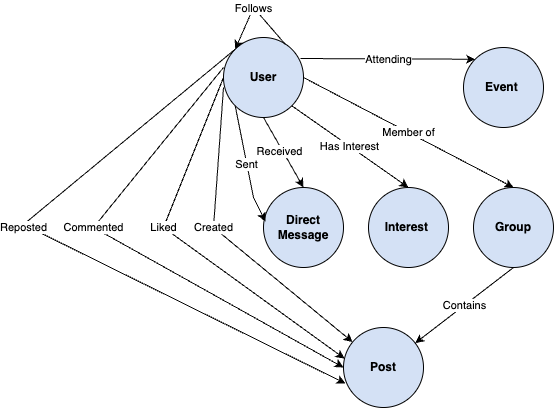

# VandyLink Social Network 

## Overview 
This document outlines the database design for a social networking platform specifically tailored for the DSI (Data Science Institute) community at Vanderbilt University . The platform facilitates professional connections, knowledge sharing, and community engagement among data science students, alumni, and faculty.

## Sketch 



## Node Types

### 1. User: Represents platform members (students, alumni, faculty)

Properties:
- userId (string): Unique identifier
- name (string): Full name
- email (string): Email address
- aboutMe (string): Professional bio
- experienceTitles (string[]): Professional roles
- experienceCompanies (string[]): Previous employers
- experienceStartDates (date[]): Role start dates
- experienceEndDates (date[]): Role end dates
- experienceLocations (string[]): Work locations
- experienceDescriptions (string[]): Role descriptions
- graduationYear (string): Expected/actual graduation
- currentTitle (string): Current role
- currentCompany (string): Current employer
- location (string): Current location
- joinDate (date): Platform join date
- lastActive (date): Last platform activity
- isAlumni (boolean): Alumni status

**Rationale**: Rich user profiles enable meaningful professional connections and facilitate mentorship opportunities within the DSI community.

### 2. Post: Represents user-generated content
Properties:
- postId (string): Unique identifier
- content (string): Post text
- timestamp (datetime): Creation time
- tags (string[]): Relevant tags
- topic (string): Primary topic category
- mediaUrl (string): Attached media

**Rationale**: Supports knowledge sharing through various content types while maintaining organized categorization.

### 3. Group: Facilitates topic-based communities
Properties:
- groupId (string): Unique identifier
- name (string): Group name
- description (string): Group purpose
- createdDate (datetime): Creation date
- category (string): Group type

**Rationale**:Enables focused discussions and collaboration around specific data science topics or projects.

### 4. Event: Manages community gatherings
Properties:
- eventId (string): Unique identifier
- title (string): Event name
- description (string): Details
- eventDate (datetime): Scheduled time
- location (string): Venue
- eventType (string): Category
- maxAttendees (integer): Capacity

**Rationale**: Supports community building through structured in-person and virtual events.

### 5. DirectMessage: Enables private communication between users
Properties:
- messageId (string): Unique identifier
- content (string): Message content
- timestamp (datetime): Message timestamp
- isRead (boolean): Read status
- mediaUrl (string): Attached media
- isDeleted (boolean): Deletion status
- isEdited (boolean): Edit status

**Rationale**: Facilitates private networking and mentorship discussions while maintaining message history and status tracking.

### 6. Interest: Represents professional and academic interests
Properties:
- interestId (string): Unique identifier
- name (string): Interest name
- category (string): Interest category
- description (string): Detailed description

**Rationale**: Enables interest-based connections and content recommendations, enhancing community engagement around specific data science topics.

## Edge Types (Relationships)

### 1. FOLLOWS
- Source: User
- Destination: User
Properties:
- since (datetime): Connection start time

**Rationale**: Creates professional network connections while tracking relationship duration.

### 2. CREATED
- Source: User
- Destination: Post
Properties:
- timestamp (datetime): Creation time
- visibility (string): Public/Private/Group

**Rationale**: Tracks content authorship and controls content visibility.

### 3. LIKED
- Source: User
- Destination: Post
Properties:
- timestamp (datetime): Like time
- reactionType (string): Type of reaction

**Rationale**: Tracks content engagement and allows for varied user reactions to support different types of appreciation.

### 4. COMMENTED
- Source: User
- Destination: Post
Properties:
- timestamp (datetime)
- content (string)  

**Rationale**: Enables threaded discussions and tracks user engagement with content.

## 5. REPOSTED
- Source: User
- Destination: Post
Properties:
- timestamp (datetime): Share time

**Rationale**: Facilitates content distribution and tracks content virality within the community.

### 6. MEMBER_OF
- Source: User
- Destination: Group
Properties:
- joinDate (datetime): Group join date
- role (string): Member/Admin/Moderator
- status (string): Active/Inactive

**Rationale**: Manages group participation and responsibilities.

### 7. ATTENDING
- Source: User
- Destination: Event
Properties:
- registrationDate (datetime): Registration time
- status (string): Confirmed/Waitlisted/Cancelled

**Rationale**: Manages event participation and capacity planning.

### 8. CONTAINS
- Source: Group
- Destination: Post
Properties:
- timestamp (datetime): Post time in group
- pinnedStatus (boolean): Pinned state

**Rationale**: Organizes group content and allows for highlighting important posts.

### 9. SENT
- Source: User
- Destination: DirectMessage
Properties:
- timestamp (datetime): Send time
- status (string): Sent/Delivered

**Rationale**: Tracks message delivery status and timing.

### 10. RECEIVED
- Source: User
- Destination: DirectMessage
Properties:
- readTimestamp (datetime): Read time
- notificationStatus (string): Sent/Delivered/Read

**Rationale**: Manages message receipt and notification states.

### 11. HAS_INTEREST
- Source: User
- Destination: Interest
Properties:
- addedDate (datetime): When interest was added

**Rationale**: Connects users with their professional interests, enabling interest-based networking and content recommendations.


## Potential Benefits and Challenges 

### Benefits 

* Professional Networking
    * **Targeted Connections**: Students can identify and connect with alumni in their desired career paths, while faculty can discover potential research assistants based on shared interests and experience. Alumni benefit by finding qualified candidates for recruitment and potential collaborators from their alma mater. A lot of the times, individuals want to network, but they don't know where to start. This platform will help them connect with individuals who have similar interests and experiences.
    * **Career Development**: Users gain valuable career insights through the experience sections that include professional trajectories. The private messaging system enables direct mentorship relationships between experienced professionals and aspiring data scientists.

* Building Community 
    * **Active Engagement**:* A lot of people come to graduate school not knowing many people in their program or the broader community. The events system bridges virtual and physical gatherings, while group discussions create topic-centered communitie that facilitate connection.  
    * **Alumni Relations**: Engaging with the alumni network m keeps graduates connected to current students and faculty, creating opportunities for alumni to contribute through mentorship and knowledge sharing while staying informed about institutional developments.


* Knowledge Sharing & Collaboration
    * **Closing Gap Between Industry and Academia**: There can often times be a gap between what is taught in the classroom and what is practiced in the industry. The platform allows for industry professionals to share their experiences and insights with students. In turn, students can share their academic knowledge and research with industry professionals.
    * **Research & Project Collaboration**: Users can efficiently coordinate academic and research activities. The group functionality supports research teams and special interest groups, while the events feature facilitates workshops and study sessions. 


### Challenges

* User Engagement 
    * **Adoption**: The platform must demonstrate clear value proposition to compete with existing professional networks like LinkedIn. This includes encouraging regular usage through unique features and maintaining an active user base despite competition from established platforms. Many of the benefits of this platform rely on network effects. If users don't see value in the platform, they won't use it and its utility will decrease. This will create a negative feedback loop where users don't see value in the platform because there are no users on the platform. 
    * **Content Quality**: Maintaining high-quality content requires active community management. This includes encouraging valuable discussions implementing measures to prevent excessive self-promotion, advertisement, or spamming.

* Platform Management
    * **Content Moderation**: Maintaining platform integrity requires active oversight of user interactions. This includes monitoring and managing content appropriateness, addressing behavioral issues, and striking a balance between free expression and professional standards.
    * **Community Guidelines**: Establishing and enforcing community guidelines is essential for fostering a positive and inclusive environment. This includes setting clear expectations for user behavior, content standards, and privacy policies. For example, alumni may get fatigued or dissatisfied with the platform if they are constantly bombarded with referall requests from students. Furthermore, making your email publicly available is a risk that opens you up to spam or harrassment. The platform must have unambiguous guidelines that protect users from these risks (while acknowleding that there is a tradeoff between privacy and networking).                                       

* Technical and Scaling Challenges
    * **Database Growth**: The platform must efficiently handle increasing data volumes while maintaining performance. This includes optimizing storage for various content types and ensuring system responsiveness as the user base grows.
    * **Feature Development**: The platform will need to continually adapt to developments in users' expectations of a social media platform and the job landscape. This will include keeping a pulse on changing user needs, integrating new functionality, and maintaining compatibility with existing features and data structures


## Setup and Installation

1. Clone the repository:

   ```
   git clone https://github.com/isabelarvelo/vandylink.git
   cd vandylink
   ```

2. Build container (make sure docker is running):

```
docker-compose up 
```

3. Open the Neo4j browser at `http://localhost:7474/` and enter the following credentials:

- Username: `neo4j`
- Password: `password`

4. Open data_insertion_and_queries.ipynb and run the cells to create the nodes and edges and run the queries. Make sure you have the `neo4j` python package installed. 


## References

I adopted a lot of the code from the in class notebook. 

I used the Cypher documentation to understand how to write the queries. For example, I was initially getting errors everytime I tried to chain multiple queries together. On this (page)[https://neo4j.com/docs/cypher-manual/current/clauses/with/], I found out that I needed to use the `WITH` clause to pass the results of one query to another.

## Generative AI Usage 

When creating the nodes and edges there were a lot of dates, users, and interactions to keep track. I used generative AI to check the logical consistency of the data insertion. I gave the model the nodes and edges and asked it if the data was logically consistent with regards to timeline. The model was able to identify inconsistencies in the data and suggest corrections. This helped in ensuring that the data was accurate and error-free.

I also used Claude Sonnet 3.5 to help me with the functions to display queries in a more readable format. Specifically, once I had the query working I provided the model with the output and a description of what I wanted the output to look like. The model was able to generate the code to format the output in the desired way. 

